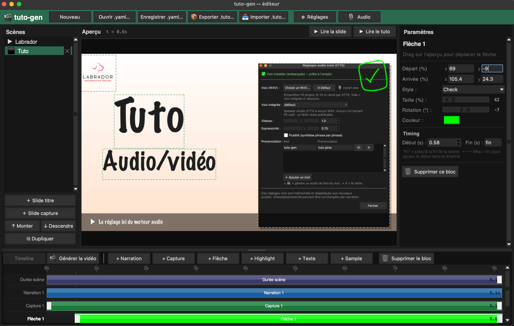
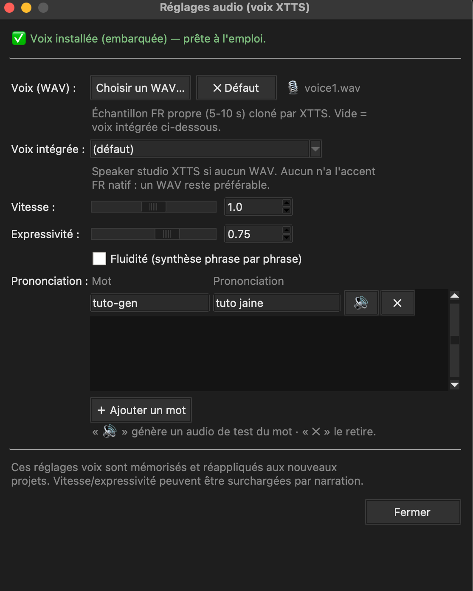

# tuto-gen

**Générateur local de vidéos de tutoriels narrés** — à partir d'un fichier YAML
(ou de l'éditeur graphique) et de quelques captures d'écran, `tuto-gen` produit
une vidéo: slides annotées + voix off française naturelle.

100 % **offline** une fois le modèle vocal installé : pas d'avatar, pas de SaaS,
aucune donnée envoyée à l'extérieur.



*L'éditeur : scènes, aperçu en direct, timeline et panneau d'annotations.*



*Réglages audio : état du moteur vocal, voix clonable et dictionnaire de prononciation.*

## Fonctionnalités

- 🎬 **Composition automatique** des slides (titre, captures annotées avec
  flèches et surbrillances, header/footer, logo).
- 🎙️ **Voix off XTTS-v2 (Coqui)** : voix française de qualité, **clonable** à
  partir d'un court échantillon WAV, ou voix intégrée.
- 📖 **Dictionnaire de prononciation** : corrige la diction des noms propres /
  jargon (ex. `Gesti'up` → `Jesti eup`), avec bouton de test à l'oreille.
- 🖥️ **Éditeur graphique** (timeline, aperçu) **et** CLI scriptable.
- 📦 **Paquet `.tuto`** : un tuto complet (YAML + médias + audio) en un fichier
  partageable, régénérable sans resynthèse.

## Moteur vocal (XTTS-v2)

La synthèse repose **uniquement** sur XTTS-v2 (approche « qualité ou rien », pas
de moteur de repli). Le modèle (~1,9 Go) **n'est pas embarqué** : il est
téléchargé **au premier lancement**.

Dans l'éditeur, ouvrez **🎙 Réglages audio** : un indicateur affiche l'état du
moteur (*installé* / *à télécharger*) et une **barre de progression** suit le
téléchargement initial. Une connexion Internet est requise cette première fois ;
ensuite tout fonctionne hors-ligne.

## Installation (développement)

```bash
python3.11 -m venv .venv
source .venv/bin/activate
pip install -r requirements.txt

# ffmpeg est requis par moviepy :
brew install ffmpeg            # macOS
```

## Utilisation

### Éditeur graphique

```bash
python -m tuto_gen gui
```

### Ligne de commande

```bash
# Générer la vidéo depuis un YAML
python -m tuto_gen build examples/tuto.yaml

# Choisir le fichier de sortie / ouvrir après génération / mode verbeux
python -m tuto_gen build examples/tuto.yaml --output ma_video.mp4
python -m tuto_gen build examples/tuto.yaml --preview
python -m tuto_gen build examples/tuto.yaml --verbose

# Lister les voix disponibles
python -m tuto_gen voices
```

Sortie attendue :

```
[1/4] Parsing tuto.yaml...          ✓
[2/4] Génération audio (...)...     ✓  2 clip(s) audio générés (14.2s total)
[3/4] Composition des slides...     ✓  3 images 1920x1080
[4/4] Assemblage vidéo...           ✓
→ output/activer_double_auth.mp4 (18.2s, 1920x1080, 30fps)
```

## Construire l'application (.app macOS)

```bash
pyinstaller --noconfirm tuto-gen.spec
# → dist/tuto-gen.app  (bundle autonome, macOS arm64)
```

> L'application construite (~950 Mo) ne se versionne pas : distribuez-la via
> **GitHub Releases**. Le modèle XTTS n'est pas embarqué dans le bundle et se
> télécharge au premier lancement (voir *Moteur vocal*).

## Projet autonome (modèle « dossier »)

Un projet est un **dossier** contenant le `tuto.yaml` et un sous-dossier `media/` :

```
MonProjet/
  tuto.yaml      # chemins relatifs → media/...
  media/         # logo, captures, fond, samples, voix… copiés sur place
```

- **À l'enregistrement**, tous les assets externes sont *rassemblés* dans `media/`
  et les chemins réécrits en relatif.
- **À l'ajout** d'une image / d'un sample / d'une voix, le fichier est copié
  immédiatement dans `media/` (dès lors que le projet a été enregistré une fois).

Conséquence : la **réouverture est fiable** même si les fichiers d'origine ont
été déplacés, et le dossier entier est déplaçable tel quel.

## Partager un tuto (paquet `.tuto`)

Un paquet `.tuto` est une archive autonome qui embarque **tout** — YAML, médias
et audio des narrations pré-généré.

```bash
# Créer le paquet depuis un projet
python -m tuto_gen pack examples/tuto.yaml -o mon_tuto.tuto

# Chez le destinataire : extraire (et éventuellement générer la vidéo)
python -m tuto_gen unpack mon_tuto.tuto --into mon_tuto/ --build
```

À l'import, le cache audio local est ré-amorcé : la vidéo se régénère **sans
resynthèse**, même sans XTTS installé. Dans l'éditeur, utilisez les boutons
**« 📦 Exporter .tuto… »** et **« 📥 Importer .tuto… »**.

## Format `tuto.yaml`

Voir [`examples/tuto.yaml`](examples/tuto.yaml) pour un exemple commenté.

- `meta` : titre, app, logo, couleurs, résolution, fps, réglages voix.
- `scenes` : liste de scènes.
  - `type: title` — slide plein écran (logo + titre + sous-titre).
  - `type: screenshot` — header (logo + titre) + capture annotée + footer
    (narration). Annotations `arrow` et `highlight`, coordonnées en **%**
    (0-100) de la zone capture.

## Architecture

```
tuto_gen/
├── cli.py          # CLI + orchestration des étapes (build/pack/unpack/gui…)
├── config.py       # parsing/validation du YAML → dataclasses
├── tts.py          # synthèse vocale XTTS-v2 + cache + état/téléchargement du modèle
├── voix_texte.py   # normalisation du texte + dictionnaire de prononciation
├── composer.py     # composition des slides (Pillow)
├── imaging.py      # chargement/normalisation des images (HEIC, SVG, WebP…)
├── fleches.py      # rendu des flèches d'annotation
├── assembler.py    # assemblage audio + images → MP4 (moviepy)
├── paquet.py       # création/extraction des paquets .tuto
├── settings.py     # réglages persistés (~/.tuto-gen/)
└── gui/            # éditeur graphique (app, timeline, aperçu, panneaux…)
```

## Assets manquants

Si un `logo` ou une `capture` référencé n'existe pas, `tuto-gen` génère un
**placeholder** (pastille avec initiale / faux écran avec libellé) : tout le
pipeline tourne sans vrais fichiers.

## Licence

Code distribué sous licence **MIT** (voir [`LICENSE`](LICENSE)).

⚠️ La licence MIT ne couvre que le code de ce dépôt. Le **modèle XTTS-v2** est
fourni par Coqui sous licence **CPML** (*Coqui Public Model License*, **usage non
commercial**) ; il n'est pas versionné ici et se télécharge au premier lancement.
